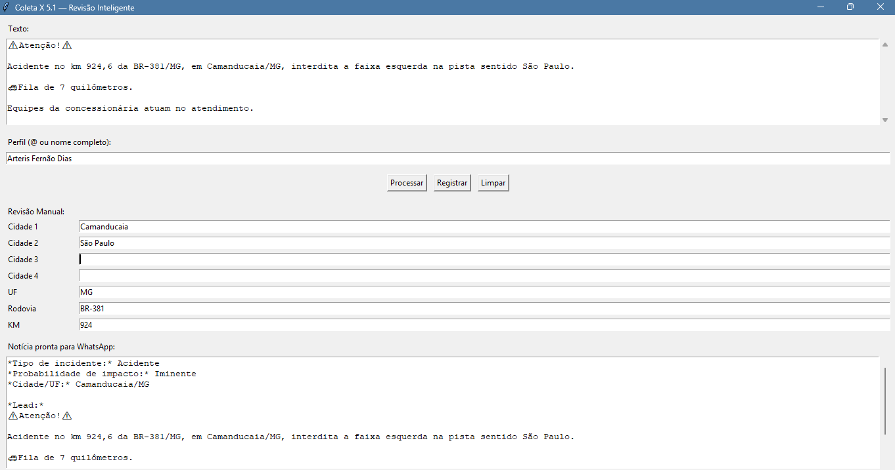
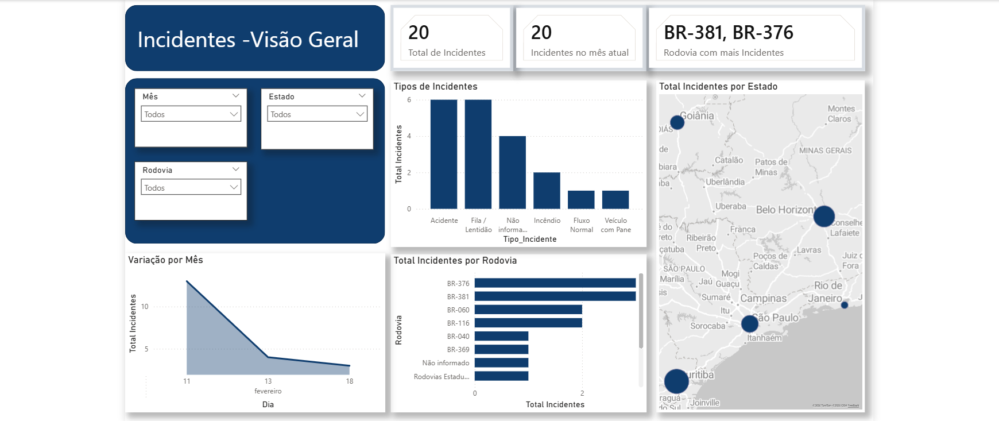

# 🚦 Coleta de Notícias do X

## Projeto de automação de monitoramento rodoviário com Python + Power BI.

Sistema de extração e classificação automática de ocorrências rodoviárias a partir de textos operacionais.

## 📌 Objetivo

Automatizar a coleta e estruturação de informações sobre incidentes rodoviários, a partir de publicações de concessionárias no X (antigo Twitter), gerando dados padronizados para análise e monitoramento operacional.

- Estrutura técnica padronizada
- Registro em CSV/Excel
- Texto formatado para WhatsApp
- Dashboard analítico em Power BI

## 🛠 Tecnologias utilizadas

- Python
- Tkinter
- Pandas
- Regex
- Power BI
- Modelagem Dimensional
- ChatGPT

## ⚙️ Funcionalidades

- Extração automática de:
  - Cidade
  - UF
  - Rodovia
  - KM
  - Tipo de incidente
- Classificação por palavras-chave
- Geração automática de notícia formatada
- Registro estruturado de dados
- Dashboard analítico com KPIs

## 🖥 Interface do Sistema



A interface foi desenvolvida em Tkinter e permite o processamento manual de publicações operacionais.

### 🔎 Como funciona:

1. O usuário cola o texto da publicação da concessionária no campo **"Texto"**.
2. Informa o perfil responsável pela publicação no campo **"Perfil"**.
3. Clica em **"Processar"**, acionando o motor de extração automática.
4. O sistema identifica e estrutura automaticamente:
   - Cidade
   - UF
   - Rodovia
   - KM
   - Tipo de incidente
5. O resultado técnico é exibido para conferência.
6. Caso necessário, o usuário pode realizar ajustes manuais antes do registro final.
7. Após validação, os dados são salvos em formato estruturado (CSV/Excel) e uma versão formatada da notícia é gerada para comunicação.

Essa abordagem combina automação com validação humana, garantindo maior precisão e confiabilidade dos dados.

## 📊 Dashboard Analítico



O projeto inclui dashboard em Power BI com:

- Total de incidentes
- Incidentes por tipo
- Incidentes por rodovia
- Análise temporal
- Filtros por data, UF e perfil

## 🚀 Como executar

```bash
python tela_tkinter.py

